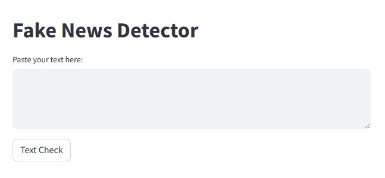

# Fake News Detection with Deep Learning



This repository contains a deep learning model for the early detection of fake news patterns in text data using advanced natural language processing techniques. The project aims to provide a tool to identify potentially misleading information by addressing linguistic complexities inherent to misinformation.

Key aspects include:

- Applying Natural Language Processing (NLP) techniques
- Testing different ML models to find the one that performs
- Creating a Streamlit app that serve as a demonstration or proof-of-concept

By strengthening the ability to discern authentic from misleading information, this work promotes transparency in the online information ecosystem. 

## Structure

The repository is structured as follows:

```
/my_streamlit_app/
|-- data/
|   |-- Fake.csv
|   |-- True.csv
|-- models/
|   |-- tfmodel
|   |-- AdaBoostClassifier.pkl
|   |-- DecisionTreeClassfier.pkl
|   |-- LinearReggresor.pkl
|   |-- vectorization.pkl
|-- src/
|   |-- data_wrangler.py
|   |-- model_loader.py
|   |-- predictor.py
|-- streamlit_app.py
|-- requirements.txt
```

## Overview

- `data/`: Contains a dummy dataset used for demonstration purposes.
- `models/`: Houses a placeholder model file.
- `src/`: Contains the source code files for various functionalities:
  - `data_wrangler.py`: Function to transform the user input.
  - `model_loader.py`: Function to load the model.
  - `predictor.py`: Function to make predictions using the loaded model.
- `streamlit_app.py`: The main Streamlit application file.
- `requirements.txt`: Lists the Python dependencies for the application.

## Usage

To run the Streamlit app locally, ensure you have the required packages installed:

```bash
pip install -r requirements.txt
```

Then, launch the app with:

```bash
streamlit run streamlit_app.py
```

## Note

This repository is for demonstration purposes. The functionalities are illustrative and may not represent a fully functional application.